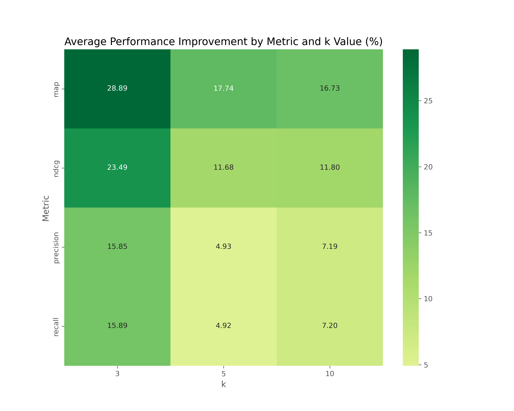

## Comparison Results

Datasets: `["arxivqa", "docvqa", "tabfquad", "tatdqa"]`

Models: 

```python
{
    'blip_Salesforce_blip-vqa-base',
    'clip_openai_clip-vit-base-patch32',
    'jina-clip-v1_jinaai_jina-clip-v1',
    'llava-interleave_llava-hf_llava-interleave-qwen-0.5b-hf',
    'siglip_google_siglip-so400m-patch14-384',
    'vit_google_vit-base-patch16-224-in21k'
 }
```

Performance Changes (After segmenting inputs)

| Model                                             | ndcg@3     | map@3      | ndcg@5     | map@5      | ndcg@10   | map@10     |
| ------------------------------------------------- | ---------- | ---------- | ---------- | ---------- | --------- | ---------- |
| blip_Salesforce_blip-vqa-base                     | -10.628756 | -10.630200 | 0.310777   | -3.085420  | -7.624803 | -6.972214  |
| clip_openai_clip-vit-base-patch32                 | 59.599957  | 64.987621  | 38.356951  | 48.328693  | 33.550816 | 43.599565  |
| jina-clip-v1_jinaai_jina-clip-v1                  | 25.326511  | 26.258869  | 23.949567  | 25.305822  | 21.521162 | 24.111294  |
| llava-interleave_llava-hf_llava-interleave-qwe... | -19.474638 | -16.147069 | -18.619666 | -16.479845 | -8.349648 | -10.328760 |
| siglip_google_siglip-so400m-patch14-384           | -6.677956  | -7.011335  | -6.052978  | -6.636861  | -5.515351 | -6.404461  |
| vit_google_vit-base-patch16-224-in21k             | 57.560575  | 72.566430  | 14.634766  | 32.413363  | 19.540038 | 31.289937  |

