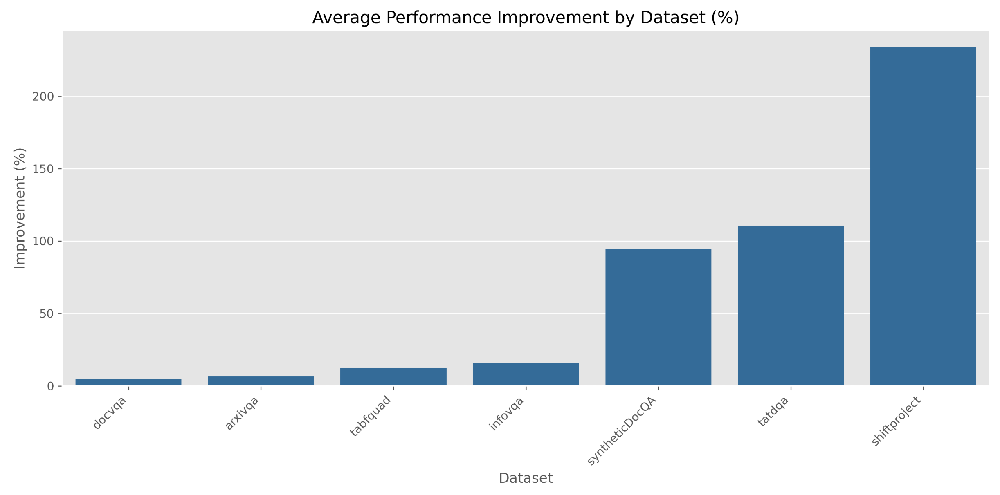

## Comparison Results

Datasets: `["arxivqa", "docvqa", "tabfquad", "tatdqa"]`

Models: 

```python
{
    'blip2-flan-t5-xl',
    'blip_Salesforce_blip-vqa-base',
    'clip_openai_clip-vit-base-patch32',
    'jina-clip-v1_jinaai_jina-clip-v1',
    'llava-interleave_llava-hf_llava-interleave-qwen-0.5b-hf',
    #'scan',
    'vit_google_vit-base-patch16-224-in21k'
}
```

Performance Changes (After segmenting inputs)

<!-- Include the result tables from ./exp2-results/ -->

| Model                                                           |   ArxivQ |   DocQ |   InfoQ |   TabF |   TATQ |   Shift |     AI |   Energy |   Gov. |   Health |
|:----------------------------------------------------------------|---------:|-------:|--------:|-------:|-------:|--------:|-------:|---------:|-------:|---------:|
| blip2-flan-t5-xl_seg_2x2                                        |    0.633 |  0.517 |   0.371 |  3.095 |  0.749 |   0     |  0     |    0     |  0     |    0     |
| blip_Salesforce_blip-vqa-base_seg_2x2                           |    0.333 |  0.333 |   0.202 |  3.095 |  0.597 |   0     |  0     |    0     |  0     |    0     |
| clip_openai_clip-vit-base-patch32_seg_2x2                       |    6.1   |  3.769 |  30.938 |  6.607 |  2.42  |   4.333 |  5.333 |   19.333 |  6.333 |   11.333 |
| jina-clip-v1_jinaai_jina-clip-v1_seg_2x2                        |   26.133 | 18.551 |  44.939 | 21.786 | 14.085 |  17.167 | 44.833 |   46.167 | 53.5   |   49.5   |
| llava-interleave_llava-hf_llava-interleave-qwen-0.5b-hf_seg_2x2 |    0.2   |  0.924 |   0     |  0     |  0     |   0     |  0     |    0     |  0     |    0     |
| siglip_google_siglip-so400m-patch14-384_seg_2x2                 |   33.7   | 22.395 |  56.579 | 35.893 | 18.348 |  15.167 | 49.833 |   49.167 |  0     |    0     |
| vit_google_vit-base-patch16-224-in21k_seg_2x2                   |    0.667 |  0.407 |   0.371 |  2.798 |  0.749 |   0.333 |  0     |    0     |  0     |    1     |

| Model                                                           |   ArxivQ |   DocQ |   InfoQ |   TabF |   TATQ |   Shift |     AI |   Energy |   Gov. |   Health |
|:----------------------------------------------------------------|---------:|-------:|--------:|-------:|-------:|--------:|-------:|---------:|-------:|---------:|
| blip2-flan-t5-xl_seg_2x2                                        |    0.733 |  0.573 |   0.523 |  4.042 |  0.953 |   0     |  0     |    0     |  0     |    0     |
| blip_Salesforce_blip-vqa-base_seg_2x2                           |    0.423 |  0.443 |   0.334 |  3.756 |  0.761 |   0.2   |  0.2   |    0     |  0     |    0.2   |
| clip_openai_clip-vit-base-patch32_seg_2x2                       |    6.68  |  3.969 |  32.426 |  7.482 |  2.715 |   4.733 |  6.633 |   19.983 |  7.083 |   11.333 |
| jina-clip-v1_jinaai_jina-clip-v1_seg_2x2                        |   27.283 | 19.438 |  46.265 | 23.196 | 15.032 |  18.617 | 47.183 |   48.067 | 55.25  |   50.85  |
| llava-interleave_llava-hf_llava-interleave-qwen-0.5b-hf_seg_2x2 |    0.24  |  1.068 |   0     |  0     |  0     |   0     |  0     |    0     |  0     |    0     |
| siglip_google_siglip-so400m-patch14-384_seg_2x2                 |   35.26  | 23.825 |  58.553 | 38.25  | 19.587 |  15.867 | 51.383 |   52.417 |  0     |    0     |
| vit_google_vit-base-patch16-224-in21k_seg_2x2                   |    0.807 |  0.407 |   0.503 |  3.173 |  0.88  |   0.333 |  0.2   |    0     |  0.45  |    1     |

| Model                                                           |   ArxivQ |   DocQ |   InfoQ |   TabF |   TATQ |   Shift |     AI |   Energy |   Gov. |   Health |
|:----------------------------------------------------------------|---------:|-------:|--------:|-------:|-------:|--------:|-------:|---------:|-------:|---------:|
| blip2-flan-t5-xl_seg_2x2                                        |    0.726 |  0.554 |   0.431 |  3.673 |  0.868 |   0     |  0     |    0     |  0     |    0     |
| blip_Salesforce_blip-vqa-base_seg_2x2                           |    0.4   |  0.362 |   0.255 |  3.665 |  0.662 |   0     |  0     |    0     |  0     |    0     |
| clip_openai_clip-vit-base-patch32_seg_2x2                       |    6.536 |  4.387 |  33.336 |  7.836 |  2.749 |   4.762 |  5.762 |   20.024 |  7.262 |   12.786 |
| jina-clip-v1_jinaai_jina-clip-v1_seg_2x2                        |   27.024 | 19.929 |  47.281 | 23.155 | 15.193 |  18.917 | 46.678 |   48.702 | 56.464 |   52.178 |
| llava-interleave_llava-hf_llava-interleave-qwen-0.5b-hf_seg_2x2 |    0.2   |  1.027 |   0     |  0     |  0     |   0     |  0     |    0     |  0     |    0     |
| siglip_google_siglip-so400m-patch14-384_seg_2x2                 |   35.512 | 23.767 |  59.213 | 39.222 | 19.499 |  16.417 | 53.964 |   51.94  |  0     |    0     |
| vit_google_vit-base-patch16-224-in21k_seg_2x2                   |    0.752 |  0.472 |   0.431 |  3.27  |  0.868 |   0.5   |  0     |    0     |  0     |    1     |

| Model                                                           |   ArxivQ |   DocQ |   InfoQ |   TabF |   TATQ |   Shift |     AI |   Energy |   Gov. |   Health |
|:----------------------------------------------------------------|---------:|-------:|--------:|-------:|-------:|--------:|-------:|---------:|-------:|---------:|
| blip2-flan-t5-xl_seg_2x2                                        |    0.898 |  0.65  |   0.693 |  5.41  |  1.239 |   0     |  0     |    0     |  0     |    0     |
| blip_Salesforce_blip-vqa-base_seg_2x2                           |    0.564 |  0.553 |   0.499 |  4.849 |  0.96  |   0.387 |  0.387 |    0     |  0     |    0.387 |
| clip_openai_clip-vit-base-patch32_seg_2x2                       |    7.594 |  4.75  |  36.01  |  9.434 |  3.29  |   5.536 |  8.171 |   21.228 |  8.554 |   12.786 |
| jina-clip-v1_jinaai_jina-clip-v1_seg_2x2                        |   29.132 | 21.551 |  49.685 | 25.676 | 16.937 |  21.457 | 50.854 |   52.06  | 59.69  |   54.631 |
| llava-interleave_llava-hf_llava-interleave-qwen-0.5b-hf_seg_2x2 |    0.277 |  1.294 |   0     |  0     |  0     |   0     |  0     |    0     |  0     |    0     |
| siglip_google_siglip-so400m-patch14-384_seg_2x2                 |   38.36  | 26.381 |  62.741 | 43.479 | 21.742 |  17.665 | 56.803 |   57.962 |  0     |    0     |
| vit_google_vit-base-patch16-224-in21k_seg_2x2                   |    1.002 |  0.472 |   0.675 |  3.976 |  1.111 |   0.5   |  0.387 |    0     |  0.818 |    1     |



